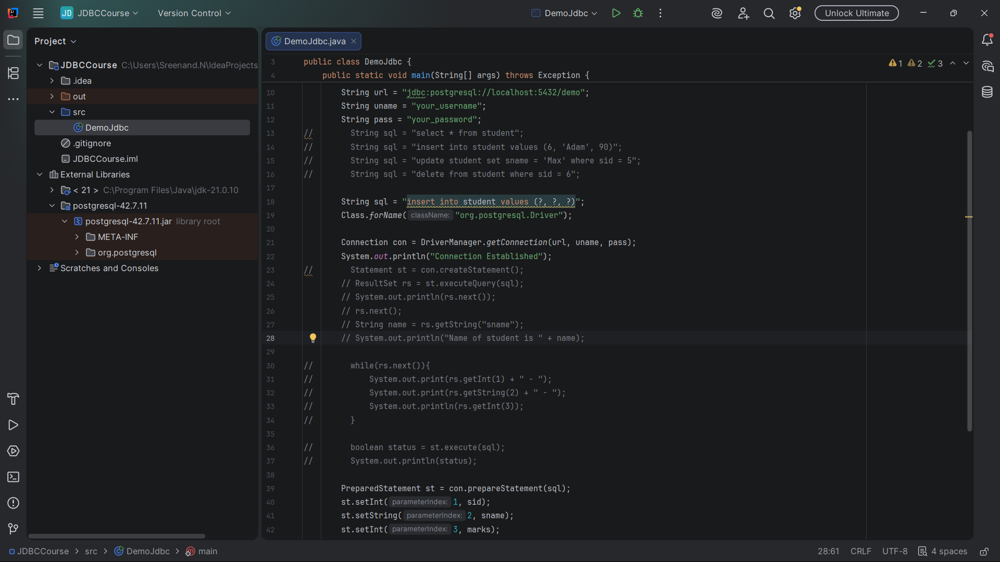
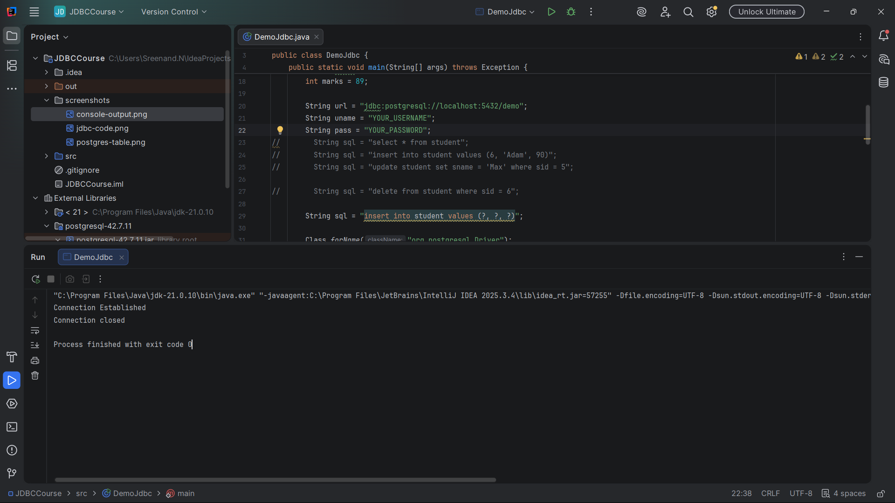
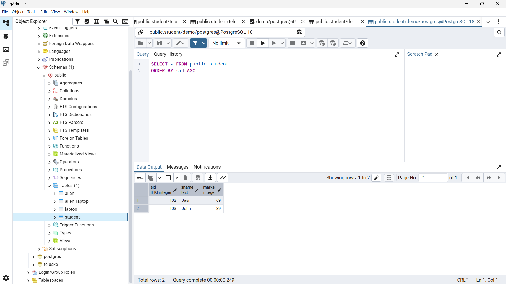

# JDBC CRUD Operations with PostgreSQL

A simple Java application demonstrating JDBC (Java Database Connectivity) concepts using PostgreSQL.

This project was created as part of my Java backend learning journey to understand how Java applications interact with relational databases.

## Features

* Connect Java application to PostgreSQL
* Execute SQL queries using JDBC
* Retrieve records using ResultSet
* Insert records using PreparedStatement
* Update existing records
* Delete records
* Close database resources properly

## Technologies Used

* Java 21
* JDBC
* PostgreSQL
* IntelliJ IDEA

## JDBC Workflow Covered

1. Import JDBC packages
2. Establish database connection
3. Create Statement / PreparedStatement
4. Execute SQL queries
5. Process results using ResultSet
6. Close database resources

## Database Configuration

### Database Name

```sql
demo
```

### Sample Table

```sql
CREATE TABLE student (
    sid INT PRIMARY KEY,
    sname VARCHAR(50),
    marks INT
);
```

## Sample Operations

### Read Data

```sql
SELECT sname
FROM student
WHERE sid = 1;
```

### Insert Data

```sql
INSERT INTO student VALUES (?, ?, ?);
```

### Update Data

```sql
UPDATE student
SET sname = 'Max'
WHERE sid = 5;
```

### Delete Data

```sql
DELETE FROM student
WHERE sid = 5;
```

## Project Structure

```text
JDBCCourse
│
├── src
├── screenshots
│   ├── jdbc-code.png
│   ├── console-output.png
│   └── postgres-table.png
├── README.md
└── .gitignore
```

## Learning Outcomes

Through this project, I gained hands-on experience with:

* JDBC Architecture
* DriverManager
* Connection
* Statement
* PreparedStatement
* ResultSet
* CRUD Operations
* PostgreSQL Integration

## Screenshots

### PreparedStatement Example



### Console Output



### PostgreSQL Table


